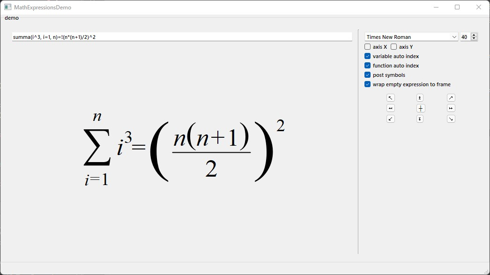
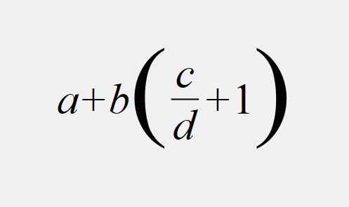
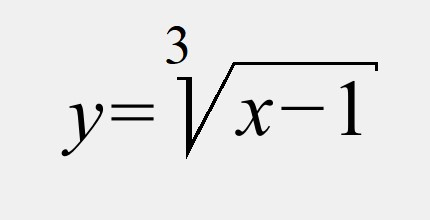

<p align="center">

</p>

# MathExpressions

**MathExpressions** небольшая C++ библиотека для отрисовки математических формул с использованием фрэймворка Qt. Изначально она была написана на Pascal(Delphi 5) Григорьевым Антоном и называлась [**ExprDraw**](https://github.com/Aleksandr185/ExprDraw).

Библиотека содержит классы, позволяющие отображать любые математические формулы. Базовым классом для всех классов библиотеки является **AbstractExpression**. Для отображения выражения необходимо построить дерево выражения, узлами и листьями которого являются экземпляры класса **AbstractExpression**. Так, например, для отображения  простой дроби используется класс **FractionExpression**, имеющий две ветви: для числителя и знаменателя. Сами ветви также могут быть составными. Класс **AbstractExpression** сообщает свои геометрические размеры, координаты надстрочных и подстрочных символов, шрифт и цвет выражения, а также содержит указатель на своего
родителя и на следующее выражение в цепочке. Геометрические размеры могут быть расчитаны только после установки шрифта и указателя на **QPaintDevice**.
При установки шрифта или цвета, эти параметры передаются всем узлам далее по цепочке.
Если цвет для узла не задан, используется цвет родителя, если родителя нет используется 
чёрный цвет.

Отображение выражения осуществляется с помощью функции **draw**. В качестве параметров ей передаются координаты вывода выражения и флаги выравнивания относительно этих координат.

Выражения можно формировать программно или использовать класс **ExpressionBuilder**. Функция **ExpressionBuilder::exec** в качестве аргумента принимает строку, которая содержит описание математического выражения. Если в процессе построения выражения возникает ошибка, функция вернет частично построенное выражение, а с помощью **ExpressionBuilder::lastError** можно узнать описание ошибки. Функция **ExpressionBuilder::exec** никогда не возвращает нулевой указатель. Полная справка по синтаксису выражений для **ExpressionBuilder** находится проекте **demo**.

Функции **AbstractExpression::multiplicationFlags()**, **AbstractExpression::isArgNeedBrackets()**, **AbstractExpression::isNeedBrackets()** используются только классом **ExpressionBuilder**.

**AbstractExpression::multiplicationFlags()** возвращает комбинацию флагов **MultiplicationFlag**, которые используются при перемножении символом '*'. Данные флаги показывают: 
-  **MultiplicationFlag::Left** - выражение может быть умножено без знака слева; 
-  **MultiplicationFlag::Right** - выражение может быть умножено без знака справа;
-  **MultiplicationFlag::Negative** - выражение является отрицательным;
-  **MultiplicationFlag::Number** - выражение является числом;
-  **MultiplicationFlag::Brackets** - выражение содержит любые скобки;
-  **MultiplicationFlag::RoundBrackets** - выражение содержит круглые скобки.
  
**AbstractExpression::isArgNeedBrackets()** возвращает **true**, если при использовании данного выражения в качестве имени функции (см. класс **CommonFunctionExpression**) аргумент должен заключаться в скобки.
  
**AbstractExpression::isNeedBrackets()** возвращает **true**, если появление данного выражения в цепочке выражений вызывает необходимость заключения данной цепочки в скобки при умножении её на другое выражене.
  
## Примеры программного формирования выражений.


#### Пример 1:

Выражение:

<p align="center">

</p>


```C++
  using namespace MathExpressions;

  ExpressionPtr expr = new VariableExpression('a');
  expr->addNext(new SignExpression(SignExpression::SignType::Plus));
  expr->addNext(new VariableExpression('b'));

  ExpressionPtr fraction = new FractionExpression( new VariableExpression('c'),
                                                   new VariableExpression('d'));
  fraction->addNext(new SignExpression(SignExpression::SignType::Plus));
  fraction->addNext(new NumberExpression(1));

  ExpressionPtr brackets = new BracketedExpression(fraction,
                                                   BracketedExpression::BracketStyle::Round);
  expr->addNext(brackets);
  expr = new ChainExpression(expr);
```

#### Пример 2:

Выражение:

<p align="center">

</p>

```C++
  ExpressionPtr radical_expr = new VariableExpression('x');
  radical_expr->addNext(new SignExpression(SignExpression::SignType::Minus));
  radical_expr->addNext(new NumberExpression(1));

  ExpressionPtr root_expr = new RootExpression(new ChainExpression(radical_expr),
                                               new NumberExpression(3));

  ExpressionPtr expr = new VariableExpression('y');
  expr->addNext(new SignExpression(SignExpression::SignType::Equals));
  expr->addNext(root_expr);
  expr = new ChainExpression(expr);
  ```
  
## Примеры формирования выражений с помощью класс ExpressionBuilder.

#### Пример 1:

Выражение:

<p align="center">

</p>

```C++
  ExpressionBuilder builder;
  ExpressionUniquePtr expr = builder.exec("a+b*(c/d+1)");
```
  
#### Пример 2:

Выражение:

<p align="center">

</p>

```C++
  ExpressionBuilder builder;
  ExpressionUniquePtr expr = builder.exec("y=root(3, x-1)");
```
  ## Иерархия классов
```
AbstractExpression
|-AbstractParentExpression
| |-AbstractBigParentExpression
| | |-FractionExpression
| | |-RootExpression
| | |-AtValueExpression
| | |-CommonFunctionExpression
| |   |-FunctionExpression
| |-ChainExpression
| | |-BracketedExpression
| |   |-RoundBracketedExpression
| |   |-ArgumentExpression
| |   |-BaseExpression
| |-AbstractTwinParentExpression
| | |-IndexExpression
| | |-GroupExpression
| |   |-SummaExpression
| |   |-ProductExpression
| |   |-CirculationExpression
| |   |-IntegralExpression
| |-LimitExpression
| |-CapExpression
| |-StandExpression
| |-MatrixExpression
| |-CaseExpression
| |-FrameExpression
|-SimpleExpression
| |-VariableExpression
| |-CustomTextExpression
| |-FunctionNameExpression
| |-AsterixExpression
|-NumberExpression
| |-ExtendedNumberExpresssion
|-CharacterExpression
| |-PlanckExpression
| |-SignExpression
| |-CommaExpression
| |-LambdaExpression
|-SpaceExpression
|-StrokesExpression
|-EmptyExpression
|-NullExpression
```
